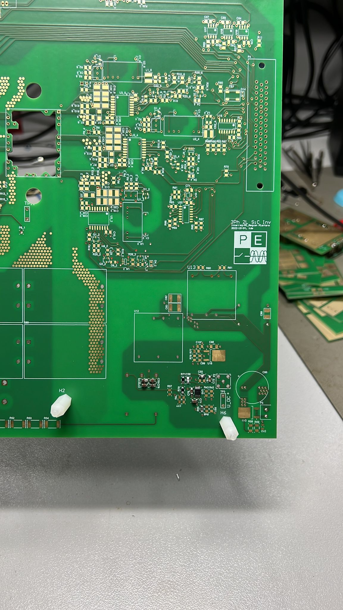
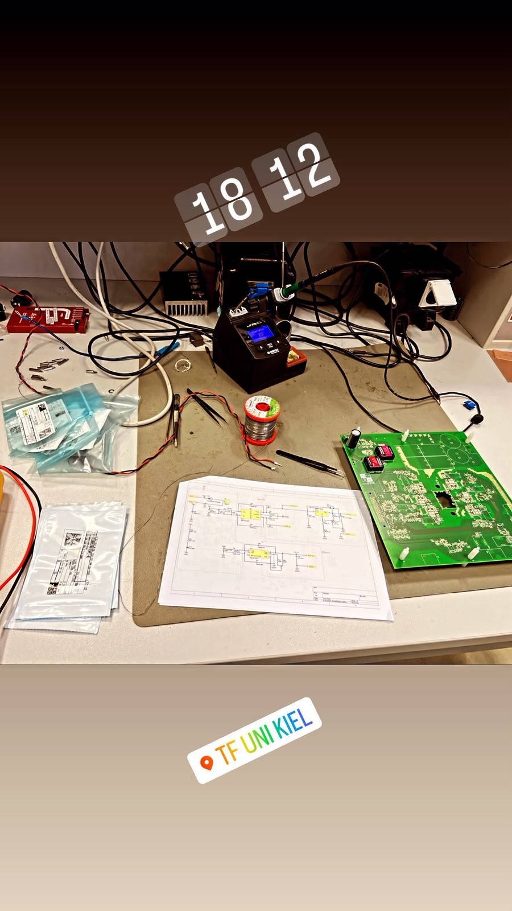
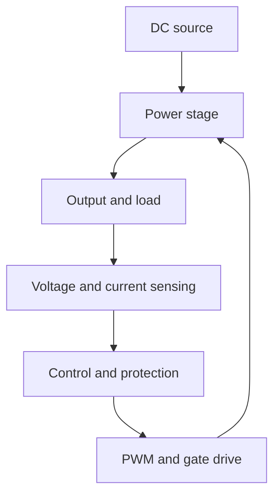

# Power Electronics Converter Control and PCB Prototyping

Hands-on work completed as a Research Assistant in the Power Electronics Laboratory at Christian-Albrechts-Universitaet zu Kiel (2022-2023).

The work covered DC/DC converter development, regulated power supplies, voltage and current control, PCB assembly, soldering, commissioning and laboratory troubleshooting. It also involved work around a three-phase two-level silicon-carbide inverter research platform.

> This repository documents my technical contribution and laboratory workflow. Exact ratings, complete schematics, firmware and proprietary design files are not published because they are not available for public release.

## Project highlights

- Contributed to power-electronics converter and power-supply development.
- Worked with closed-loop voltage and current regulation.
- Supported PCB population, soldering, inspection and rework.
- Used electrical schematics during assembly and troubleshooting.
- Performed staged commissioning and functional verification in a laboratory environment.
- Investigated faults at board and component level using standard laboratory instruments.
- Documented hardware observations, test conditions and corrective actions.

## Hardware platform

The photographed board is labelled **3Ph 2L SiC Inv**, identifying it as a three-phase, two-level silicon-carbide inverter research platform.



The laboratory work included PCB handling, component placement and soldering, schematic-guided assembly, inspection and preparation for electrical testing.



### Verified hardware from the project BOM

The supplied bill of materials confirms the following core functions:

- **Power stage:** Danfoss Silicon Power MiniPack1b three-phase SiC MOSFET module, rated 1,200 V and 30 A
- **Gate drive:** six onsemi NCV57001 isolated high-current gate-driver ICs
- **Current measurement:** three LEM LESR 25-NP current sensors
- **Voltage measurement:** one LEM LV25-P Hall-effect voltage transducer
- **Isolated auxiliary supplies:** Murata NMK0512SC 5 V to +12 V/-12 V, 2 W DC/DC modules
- **Auxiliary power conversion:** Traco Power THL 25-2411, 25 W isolated DC/DC converter
- **DC-link components:** 470 uF / 400 V electrolytic and 50 uF / 450 V film capacitors
- **Signal conditioning:** LT1809 and OPA211 operational amplifiers, TLV9032 precision comparators and digital logic
- **Protection and filtering:** MOV, TVS and Zener devices, Schottky diodes, inductors and common-mode chokes

The component-level summary is documented in [Verified component summary](docs/component-summary.md). The original purchasing workbook is intentionally excluded from the public repository.

## Functional architecture



This is a functional representation of the development work. It is intentionally topology-neutral because the complete circuit and controller implementation are not included in the available public material.

## Voltage and current control

A regulated converter commonly uses two coordinated feedback loops:

1. **Outer voltage loop** - compares the measured output voltage with the voltage reference and produces a current reference.
2. **Inner current loop** - compares measured current with the current reference and adjusts the PWM command.

Conceptually:

```text
voltage_error = voltage_reference - measured_voltage
current_reference = voltage_controller(voltage_error)

current_error = current_reference - measured_current
pwm_command = current_controller(current_error)
```

The command must be limited before reaching the modulator, and fault conditions must override normal control. Practical protection functions may include overcurrent, overvoltage, undervoltage and temperature limits. The exact controller gains and thresholds used in the laboratory are not published here because verified values are unavailable.

More detail is provided in [Control strategy](docs/control-strategy.md).

## Development workflow

1. Review the circuit requirements and schematic.
2. Check component values, packages, orientation and ratings.
3. Populate and solder the PCB in controlled stages.
4. Inspect solder joints, component placement and possible shorts.
5. Verify low-voltage auxiliary supplies before energising the power stage.
6. Test sensing, controller and gate-drive sections independently where possible.
7. Apply current-limited power and monitor critical nodes.
8. Compare measurements with expected behaviour.
9. Isolate faults, rework the affected area and repeat verification.
10. Record the test conditions, observations and corrective actions.

## Laboratory methods

The work involved or was supported by:

- Digital multimeter measurements
- Oscilloscope-based waveform inspection
- Function-generator signals
- Bench power supplies with current limiting
- Continuity and short-circuit checks
- Visual inspection and solder rework
- Schematic-based fault tracing
- Controlled start-up and repeated functional testing

See [Hardware and testing](docs/hardware-and-testing.md) for the verification approach.

## Repository structure

```text
power-electronics-converter-control/
├── README.md
├── PROFILE_ENTRY.md
├── NOTICE.md
├── assets/
│   ├── laboratory-workbench.jpeg
│   └── sic-inverter-pcb.jpeg
└── docs/
    ├── control-strategy.md
    ├── component-summary.md
    ├── hardware-and-testing.md
    └── project-scope.md
```

## Skills demonstrated

`Power electronics` `DC/DC converters` `Voltage control` `Current control` `PWM` `Power supplies` `PCB assembly` `Soldering` `Commissioning` `Troubleshooting` `Altium Designer` `EPLAN P8` `Oscilloscope` `Technical documentation`

## Author

**Muhammad Kazim**  
M.Sc. Electrical and Information Engineering  
[LinkedIn](https://www.linkedin.com/in/muhammad-kazim786/) | [GitHub](https://github.com/muhammadkazim763-hub)
